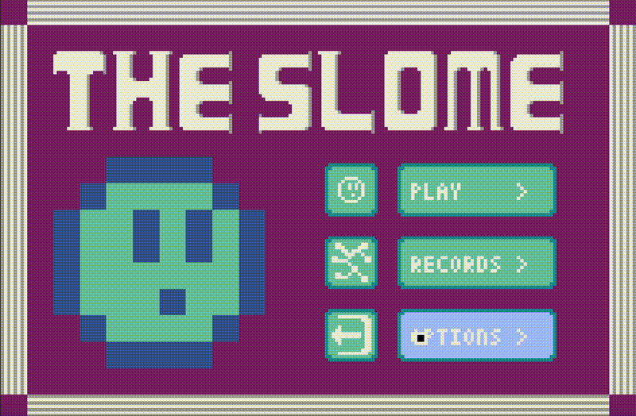

# The Slome



The Slome is a small retro platformer built with [Pyxel](https://github.com/kitao/pyxel): guide a slime through the level to the portal as fast as you can, collect orbs along the way, and beat the medal times to earn bronze, silver, and gold.

**[▶ Play in browser](https://slome.silvanguntlin.com)**

## Controls

| Key | Action |
| --- | --- |
| `A` / `D` | Move left / right |
| `Space` | Jump |
| `S` | Crouch (charges your next jump) |
| `P` | Pause / continue |
| `R` | Restart the level |
| Mouse | Navigate the menus |

**Charge jump:** press `S` while on the ground to crouch — the slime freezes briefly to charge. If you jump within one second of crouching, you get a much higher jump than normal. You'll need it to reach the upper platforms.

## Run locally

```sh
pip install pyxel
python3 game.py
```

## Rebuild the web version

The browser build lives in `docs/index.html` (served by GitHub Pages). To regenerate it after changing the game:

```sh
make web
```

This packages `game.py` + `resources.pyxres` into a `.pyxapp` with `pyxel package` and converts it to a standalone HTML file with `pyxel app2html`.

## License

MIT — see [LICENSE](LICENSE).
